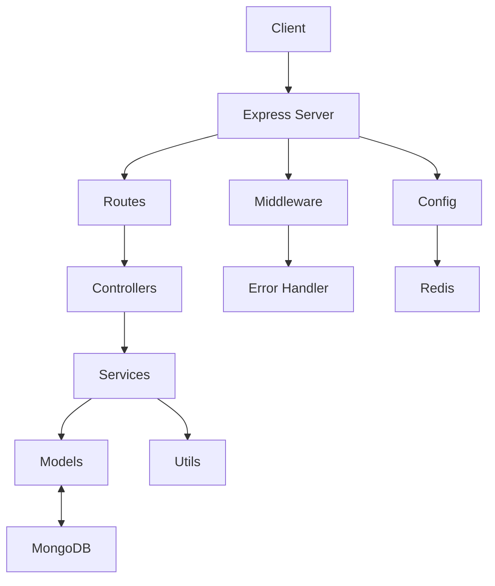

---

## **Project Overview**

This project is a Node.js backend API for user authentication, built with Express, MongoDB (via Mongoose), and JWT for token-based authentication. It features user registration and login, with robust error handling and token management.

---

## **High-Level Architecture**

```
<code_block_to_apply_changes_from>
```

---

## **Detailed Component Breakdown**

### 1. **Entry Point: `server.js`**
- Loads environment variables.
- Connects to MongoDB.
- Sets up Express app and global middleware (`cors`, `express.json()`).
- Registers authentication routes under `/api/auth`.
- Registers a root route (`/`) for health check.
- Registers the global error handler middleware.
- Starts the server after DB connection.

### 2. **Configuration: `config/`**
- **`index.js`**: Loads and validates environment variables (e.g., DB URI, JWT secrets).
- **`database.js`**: Connects to MongoDB using Mongoose.
- **`redis.js`**: Sets up a Redis client (not used in current logic, but ready for caching/session).

### 3. **Routing: `routes/authRoutes.js`**
- Defines `/register` and `/login` POST endpoints.
- Delegates requests to controller functions.

### 4. **Controllers: `controllers/authController.js`**
- **`register`**: Handles user registration requests.
- **`login`**: Handles user login requests.
- Both call service functions and return responses, or pass errors to the error handler.

### 5. **Services: `services/authService.js`**
- **`register`**:
  - Validates input using Zod schemas.
  - Checks for existing user.
  - Hashes password.
  - Creates user and refresh token in DB.
  - Returns user info and tokens.
- **`login`**:
  - Validates input.
  - Checks user credentials.
  - Issues new tokens and updates/creates refresh token in DB.
  - Returns user info and tokens.
- Throws `AppError` for business logic errors.

### 6. **Models: `models/User.js`, `models/Token.js`**
- **`User.js`**: Mongoose schema for user data (name, email, password, isVerified).
- **`Token.js`**: Mongoose schema for refresh tokens (userId, token, expiry).

### 7. **Middleware**
- **`authMiddleware.js`**: Protects routes by verifying JWT access tokens.
- **`errorHandler.js`**: Catches and formats all errors, sending consistent JSON responses.

### 8. **Utils**
- **`AppError.js`**: Custom error class for operational errors.
- **`generateToken.js`**: Functions to generate JWT access and refresh tokens.

### 9. **Validation: `validators/authSchema.js`**
- Zod schemas for validating registration and login data.

---

## **Request Flow Example: Registration**

1. **Client** sends POST `/api/auth/register` with user data.
2. **Route** forwards to `authController.register`.
3. **Controller** calls `authService.register`.
4. **Service**:
   - Validates input.
   - Checks for existing user.
   - Hashes password.
   - Creates user and refresh token.
   - Returns user info and tokens.
5. **Controller** sends success response.
6. **If error occurs** (e.g., email exists), `AppError` is thrown, caught by controller, passed to `errorHandler`, which sends a formatted error response.

---

## **Error Handling**

- All business logic errors use `AppError`.
- Controllers use `try/catch` and `next(err)` to forward errors.
- `errorHandler.js` middleware formats and sends error responses.

---

## **Security**

- Passwords are hashed with bcrypt.
- JWTs are used for authentication.
- Refresh tokens are stored in the database.
- `authMiddleware.js` can be used to protect routes (not currently applied to `/register` or `/login`).

---

## **Extensibility**

- Redis is set up for future caching/session management.
- Modular structure allows easy addition of new features (e.g., email verification, password reset).

---

## **Project Documentation (Markdown Example)**

```markdown
# DevTinder Backend API

## Overview

A Node.js/Express backend for user authentication, using MongoDB, JWT, and robust error handling.

## Architecture

- **Express** for routing and middleware
- **MongoDB** (via Mongoose) for data storage
- **JWT** for authentication
- **Zod** for input validation
- **Redis** (prepared for future use)

## Main Components

- **server.js**: App entry point, sets up middleware, routes, DB, and error handling.
- **config/**: Environment, DB, and Redis configuration.
- **routes/**: API route definitions.
- **controllers/**: Handle HTTP requests and responses.
- **services/**: Business logic (registration, login).
- **models/**: Mongoose schemas for User and Token.
- **middleware/**: Auth and error handling.
- **utils/**: Custom error class and token generation.
- **validators/**: Zod schemas for input validation.

## API Endpoints

- `POST /api/auth/register`: Register a new user.
- `POST /api/auth/login`: Login and receive tokens.

## Error Handling

- Uses a custom `AppError` class for operational errors.
- Centralized error handler middleware for consistent responses.

## Security

- Passwords hashed with bcrypt.
- JWT access and refresh tokens.
- Refresh tokens stored in DB.

## Extending

- Add more routes/controllers/services for new features.
- Use Redis for caching or session management.

## Example Request Flow

1. Client sends request.
2. Route forwards to controller.
3. Controller calls service.
4. Service interacts with DB, returns result or throws error.
5. Controller sends response or passes error to error handler.

## Environment Variables

- `MONGO_URI`
- `JWT_SECRET_ACCESS`
- `JWT_SECRET_REFRESH`
- `JWT_ACCESS_EXPIRES_IN`
- `JWT_REFRESH_EXPIRES_IN`
- `REDIS_URL` (optional)

---

## Diagram


```

---

Let me know if you want this documentation saved to a file, or if you want a more detailed breakdown of any specific part!